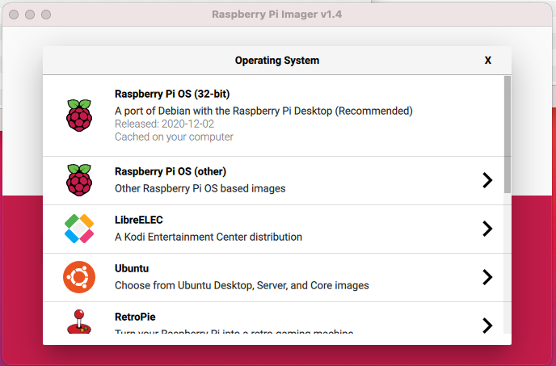
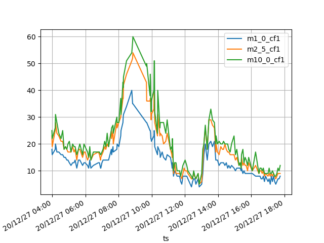

# PPM - Proyecto de monitoreo de la calidad del aire. 
## Introducción
Este proyecto tiene como objetivo crear un protocolo para el monitoreo de la calidad del aire que permite conocer a quien lo construye la cantidad de particulas suspendidas en el aire. En algunas ciudades como la Ciudad de México, se cuenta desde hace varios años con un sistema de monitoreo que permite informar a la población y a las autoridades de la calidad del aire de la ciudad. A este sistema se le conoce como **Indice Metropolitano de la Calidad del Aire (IMECA)**. En este proyecto vamos a generar un sistema de monitorio que permita medir la concentración de partículas suspendidas en el aire, las cuales se almacenarán en una base de datos y generará un reporte díario de la concentración de partículas. La siguiente gráfica muestra la clasificación de la calidad. <br>

(Fuente: https://es.wikipedia.org/wiki/%C3%8Dndice_metropolitano_de_la_calidad_del_aire)
## Materiales
* Raspberry pi.
* Protoboard.
* 4 cables dupont.
* <a href="https://www.espruino.com/PMS7003">Sensor de partículas PMS7003</a>
## Paso 1 - Configuración de la Raspberry Pi.
El primer paso consiste en instalar el sistema operativo a la computadora **Raspberry Pi**. Existen múltiples formas de hacerlo, sin embargo, la más simple consiste en utilizar el software <a href="https://www.raspberrypi.org/software/">Raspberry Pi Imager</a>. El programa es muy fácil de utilizar simplemente tienes que elegir el sistema operativo insertar tu tarjeta y seguir los pasos que se te indican. Existe un sistema operativo especialmente diseñado para el uso con la Raspberry Pi, que está señalado como la opción por defecto (*Raspberry Pi OS (32-bit)*). Los siguientes pasos asumen que tienes instalado este sistema operativo.<br>
<br>
Una vez que hayas instalado el sistema operativo en la tarjeta SD, insertalo en tu **Raspberry Pi** y conectalo a la corriente, a tu monitor y tu teclado. La primera vez que lo utilices tendrás que configurar el sistema como se indica a través de los cuadros de dialogo. (**Nota: El resto de las instrucciones consideran que el lenguaje del sistema operativo está en inglés, por lo que te recomiendo instalarlo en este idioma.**)<br>
**Es recomendable cambiar la contraseña por defecto para una mayor seguridad.** Para esto escribre el siguiente comando en la terminal.
```
passwd
```
El contraseña por defecto es `raspberry`. 

## Paso 2 - Habilita el puerto serial y la conexión SSH
Los puertos seriales y de conexión SSH están desabilitados por defectos, para poder desarrollar este proyecto deberás de habilitar de la siguiente forma. Primero abra la terminal y escribe el siguiente comando. 
```
sudo raspi-config
```
Te aparecerá la siguiente ventana de diálogo, seleccional la opción **Select -> Interfacing Options**<br>
<br>
Posteriormente, selecciona esta opción para habilitar el puerto serial (**UART**). <br>
<br>
Habilita el puerto serial cuando te lo solicite. <br>
<br>
Reinicia la computadora para que los cambios tengan efecto.
## Paso 3 - Conexión del sensor
El sensor de partículas <a href="https://www.espruino.com/PMS7003">PMS7003</a> utiliza conexión serial para enviar los datos que genera. Existen varios modos de operación los cuales puedes consultar en las hojas de especificaciones. Para este proyecto vamos a utilizar la configuración de sensor activo de manera que registre datos de manera continua. De acuerdo al diagrama de especificaciones el sensor cuenta con las siguientes terminales.
<div>
  
</div>
En este proyecto únicamente vamos a utilizar las siguientes 4 terminales:

1. **Vcc** - Voltaje a 5V: Pines 1 o 2.
1. **GDC** - Tierra: Pines 3 o 4.
1. **RX** - Transmisión. Pin 7.
1. **TX** - Recepción. Pin 9.

Estos 4 cables deberán de conectar a 4 de las terminales de tu Rasberry. Si utilizas una Raspberry 3, 
<div>
  
</div>
Conecta los pines de la siguiente forma:
<center>
  
Raspberry    | Sensor
------------ | -------------
Vcc - 2 o 4  | Vcc - 1 o 2
GND - 6      | GND - 3 o 4
RX  - 10 (GPIO15) | TX - 9
TX  - 8 (GPIO14)  | RX - 7

</center>

## Paso 4 - Descarga el código.
Para descargar el codigo lo deberás de ingresar el siguiente comando en la terminal. 
```
git clone https://github.com/ladominguez/ppm.git
```
Esto creará un directorio llamado `ppm` con todos los archivos necesarios para ejecutar el programa. Escribe los siguientes comandos para instalar las librerias necesarias.
```
cd ppm
sudo pip3 install -r requirements.txt
```

## Paso 5 - Crea una base de datos
Introduce en la terminal los siguientes comandos para crear la base de datos `air_quality.db`. El sensor produce 12 valores diferentes de calidad del aire, es este proyecto únicamente vamos a graficar los tres primeros que corresponden a PM1, PM2.5 y PM10. Consulta la <a href="https://www.evelta.com/content/datasheets/203-PMS7003.pdf">hoja de especificaciones</a> para mayor información.

```
sqlite3 air_quality.db
sqlite> CREATE TABLE measurements2 (ts integer primary key, m1_0_cf1 integer, m2_5_cf1 integer, m10_0_cf1 integer, m1_0_atmo integer, m2_5_atmo integer, m10_0_atmo integer, m0_3_ct integer, m0_5_ct integer, m1_0_ct integer, m2_5_ct integer, m5_0_ct integer, m10_0_ct integer);
sqlite> .exit
```
## Paso 6 - Prueba que el código funcione correctamente
Antes de añadir el servicio de Linux, vamos a verificar que este leyendo los datos correctamente. Ejecutalo como superusuario con Python versión 3.

```
sudo python3 pollution.py
```
## Paso 7 - Agrega el programa como un servicio de Linux
Para inciar el programa de manera autónoma cada vez que enciendas las computadora, se puede registrar como un servicio de Linux. Esto te permitirá conocer el estado del sensor y tener un registro de los eventos que se registran en el `log`. En caso de ser necesario haz las modificaciones que consideres pertinentes al archivo `polution.service`. Una vez modificado crea un enlace simbólico (symbolic link) de la siguiente manera.

```
sudo ln -s /home/pi/ppm/pollution.service /etc/systemd/system/pollution.service
```
Posteriormente recarga los archivos de servicio para incluir el nuevo servicio.

```
sudo systemctl daemon-reload

```
Para iniciar el servicio de manera manual usa el siguiente comando,

```
sudo systemctl start pollution.service
```

Para conocer el estado del servicio,

```
sudo systemctl status pollution.service
```
Finalmente, para iniciar el servicio cada vez que inicia el sistema utiliza.
```
sudo systemctl enable pollution.service
```
## Paso 7 - Genera gráficas diarias (crontab)
Linux permite ejecutar programas de manera regular utilizando la utilería de `crontab`. Para editarlo utiliza el siguiente cmando,

```
crontab -e
```
Si es la primera vez que lo ejecutas te preguntará que editor de texto deseas utilizar. El formato de crontab contiene 6 columnas como se muestra. En el caso de que requieras que se ejecute el comando en todos los valores posibles puede utilizar el símbolo de *. 
<pre>
<strong>Campo    Descripción    Valores permitidos</strong>
MIN      Minuto            0 a 59
HOUR     Hora              0 a 23
DOM      Día del mes       1-31
MON      Mes               1-12
DOW      Día de la semana  0-6
CMD      Comando           Comando a ser ejecutado.
</pre>

El programa `create_chart.py` generá un gráfica con los valores leidos por el sensor. Por ejemplo, si deseas crear una gráfica de manera diaria a las 6:15AM. Añade la siguiente línea al final del archivo de `crontab`.

```
15 6 * * * /usr/bin/python3 /home/pi/ppm/create_chart.py
```
## Paso 8 - Genera una gráfica 
Para verificar que el sensor está funcionando de manera adecuada. Espera algunas horas a que se colecten algunos datos y genera una gráfica de manera manual con el siguiente comando.

```
/usr/bin/python3 /home/pi/ppm/create_chart.py
```
Deberías de obtener una gráfica similar a la que se muestra a continuación. 
<div>
 
</div>
